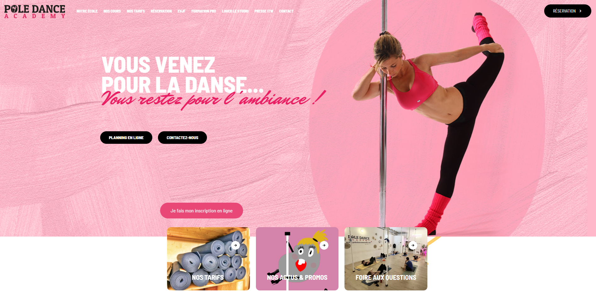
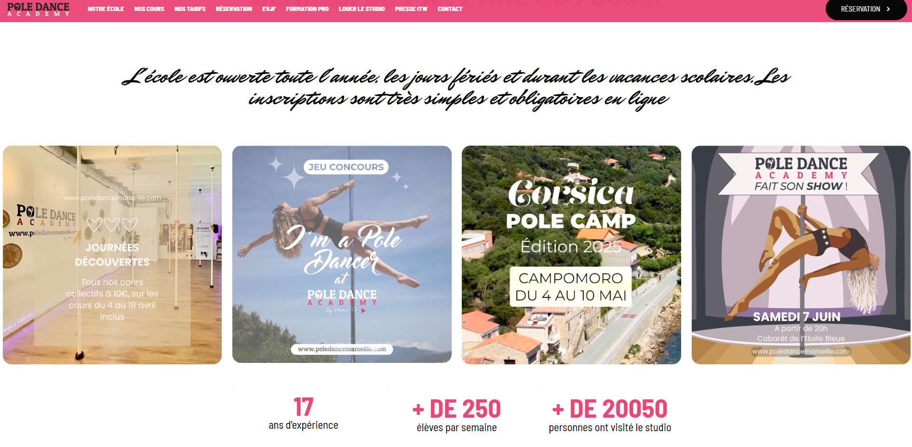
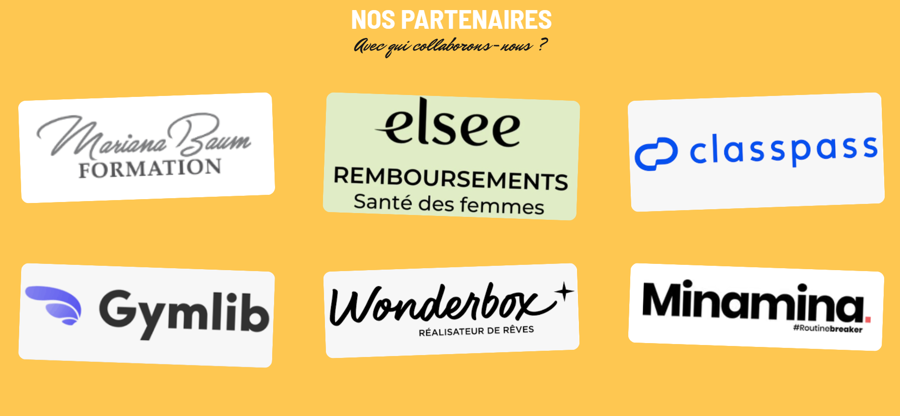

# Création d’un site pour promouvoir une école de Pole Dance

Dans le cadre d'un stage en première année de BTS Informatique option Réseaux, j'ai travaillé avec une école de pole dance à Marseille qui avait besoin d’un nouveau site web pour promouvoir son activité et pouvoir gérer de manière autonome la mise à jour de ses contenus.

Pour mener à bien ce projet, j’ai utilisé **WordPress**, un **CMS** (Content Management System), pour la gestion et la création du site.  
J’ai également eu recours à **Dreamweaver**, un éditeur de code orienté web, ainsi qu’à **Photoshop** en tant qu’éditeur d'images.

À partir de la maquette réalisée sur Photoshop, j’ai sélectionné les templates les plus adaptés parmi ceux disponibles. J’ai ensuite découpé les éléments graphiques de la maquette, puis intégré le contenu textuel et visuel dans les différents blocs de la page. Enfin, j’ai apporté des ajustements en **CSS** afin de respecter fidèlement le design initial.

# EXEMPLE DE PAGE RÉALISÉ : 

## [Voir en ligne](https://www.poledancemarseille.com/)

## 

## [🌐 Voir le site web de Pole Dance Marseille](https://www.poledancemarseille.com/)

  <a href="https://www.poledancemarseille.com/" target="_blank" style="background-color: #008C9E; padding: 10px 20px; color: white; text-decoration: none; font-weight: bold; border-radius: 5px; font-size: 16px;">Consulter le site de Pole Dance Marseille</a>

